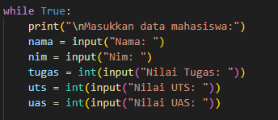
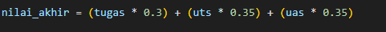
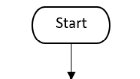
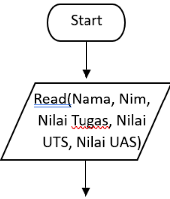
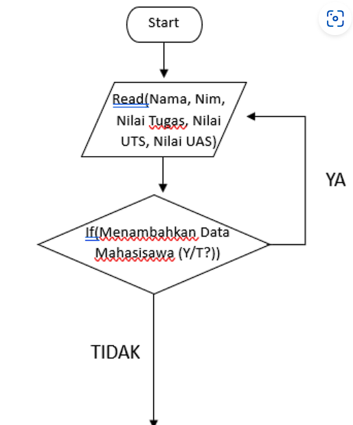
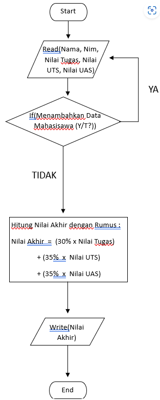

# labpy04
* LAPORAM PRAKTIKUM
* CODE PROGRAM NILAI AKHIR
* Flowchart
## CODE PROGRAM NILAI AKHIR
## STEP 1: MENGENISIALISASI LIST DATA MAHASISWA
* Program dimulai dengan menginisialisasi sebuah list kosong bernama data_mahasiswa untuk menyimpan data setiap mahasiswa. List ini akan diisi dengan data mahasiswa yang diinput selama program berjalan
  
  

## STEP 2: INPUT DATA MAHASISWA DAN PERULANGAN WHILE

* Program kemudian masuk ke dalam sebuah perulangan while yang memungkinkan pengguna untuk memasukkan data mahasiswa secara berulang hingga pengguna memilih untuk berhenti
1. Nama mahasiswa
2. Nim Maahasiswa
3. nilai Tugas: proggram meminta input nilai tugas mahasiswa dalam bentuk integer
4. Nilai UTS: Program meminta input nilai UTS mahasiswa dalam bentuk integer
5. Nilai UAS: Program meminta input nilai UAS mahasiswa dalam bentuk integer.
   
   

## STEP 3: MENGHITUNG NILAI AKHIR

* Setelah menerima input nilai tugas, UTS, UAS program menghitug nilai akhir mahasiswa dengan menggunakan formula berikut:
  
  

## STEP 4: SIMPAN DATA MAHASISWA

  
  
## STEP 5: CODE SELEKSI UNTUK TANYAKAN TAMBAHAN DATA MAHASISWA

* Setelah menyimpan data, program bertanya kepada pengguna apakah ingin menambah data mahasiswa lagi atau tidak. If pengguna mengetik y, program akan mengulangi proses input. Jika pengguna mengetik t, perulangan akan berhenti, berikan perintah break untuk menghentikan Program
  
  
  
## STEP 6: pRINT DATA MAHASISWA
* perulangan selesai (pengguna memilih t untuk berhenti menambah data), program akan menampilkan daftar data mahasiswa yang telah dimasukkan. Untuk setiap mahasiswa data yang ditampilkan meliputi nama, nim, nilai tugas, nilai UTS, nilai UAS, dan nilai akhir :
  
  
  
## STEP 7: BERI BATAS BAWAH
* '=' dikalikan 80:
  
  
  
## STEP 8: TEST CODE PROGRAM
* Jalankan code program dengan memasukan nama, nilai tugas, nilai uts, nilai uas
1. Nama:
2. Nim:
3. nilai tugas
4. Nilai UTS
5. Nilai UAS
   
   
   
## FLOWCHART NILAI AKHIR
* Step 1.
  
  
  
## STEP 2: INPUT DATA MAHASISWA

  

## STEP 3: LAKUKAN SELEKSI

  
  
## STEP 4: PROSES PERHITUNGAN

  
  
## STEP 5: OUTPUT NILAI AKHIR

  
  
## STEP 6: FND

  
  
* finish
